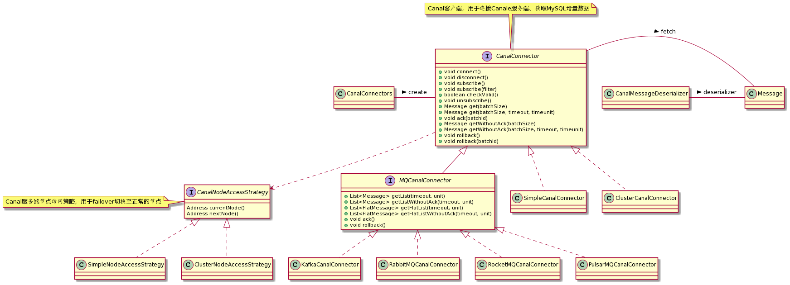

## Canal Nodejs

> 此应用是 node js 版本的 [Canal](https://github.com/alibaba/canal) 客户端。
>
> 它可以让你在 node js 环境中对 MySQL 数据库中的数据进行增量订阅 & 消费。更多信息请看 [Canal wiki]( https://github.com/alibaba/canal/wiki)


## 快速开始

### 构建

1. 安装 node js & npm

2. 下载本项目代码

   `git clone https://github.com/marmot-z/canal-nodejs.git`

3. 下载依赖

   ```shell
   cd canal-nodejs/
   npm install
   ```

### 运行

1. [安装 Canal Server](https://github.com/alibaba/canal/wiki/QuickStart) 

2. 启动demo代码

   ```shell
   chmod +x example/start.sh
   
   # 按照实际部署情况进行填写
   # -h canal server 主机地址
   # -p canal server 监听端口
   # -d canal server destination
   # -u 登录名
   # -p 密码
   ./example/start.sh -h 127.0.0.1 -p 11111 -d example
   ```

3. 修改监听的 MySQL 库表，例如进行以下操作

   ```sql
   Insert into table1(id, name) values(null, 'wangwu');
   ```

   程序会打印以下结果

   ```
   Empty message.
   Empty message.
   id : 18   update = true
   name : zhangx   update = true
   Empty message.
   Empty message.
   ```

## 相关设计

如果你想了解或者设计 Canal 客户端，那你可以去参考一下 [Canal Java Client](https://github.com/alibaba/canal/tree/master/client) 是如何设计的。在你动身之前，或许我总结的图例可以给你一些帮助。如下：




***<u>如果这个项目给你带来一些帮助，请帮我点亮 :star2: 吧</u>***